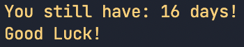
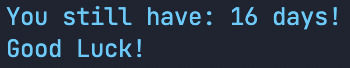

# Examdays

*A Python module that helps you to calculate how many days will you have for preparing your exam.*


## Installation

```
pip install examdays
```

## Usage

```python
from examdays import exam

exam(end_year, end_month, end_day)

'''
For example:
If your exam is on 2021,6,30

Then:
exam(2021,6,30)

'''

```

or:

```python
import examdays

examdays.exam(end_year, end_month, end_day)

```

or in Command Line:

```
$ examdays [end year] [end month] [end day] 
```

If you want to use specific colour in the output:

```
$ examdays [end year] [end month] [end day] [colour]
```

### Colour List:

+ BLACK
+ RED 
+ GREEN 
+ YELLOW 
+ BLUE 
+ MAGENTA
+ CYAN
+ WHITE 


## Example

```
$ examdays 2021 6 20
```

Output:
```
You still have: 6 days!
Good Luck! 
```

### With Colour:

```
$ examdays 2021 6 30 YELLOW
```
Output:



```
$ examdays 2021 6 30 blue
```

Output:



## TODO

 * [ ] Add Timer function

## License

MIT